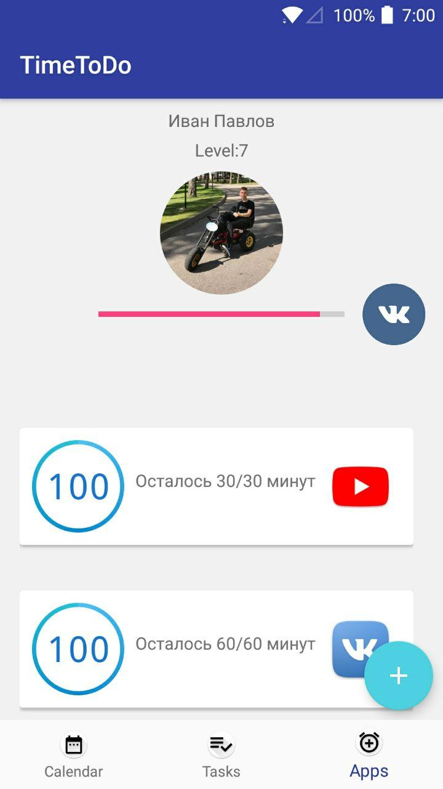
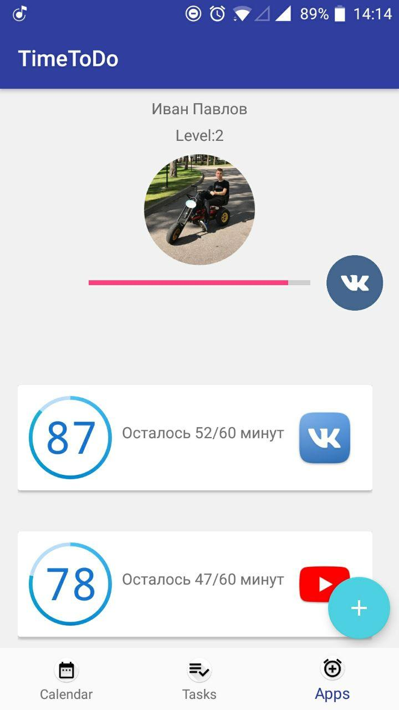
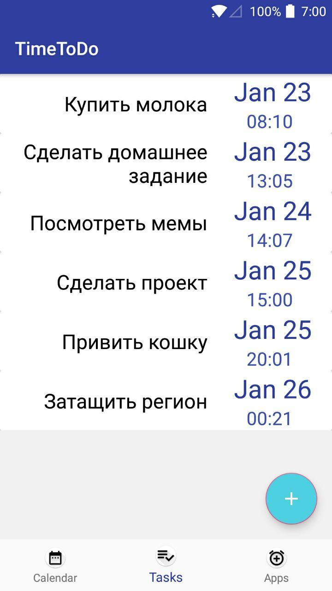
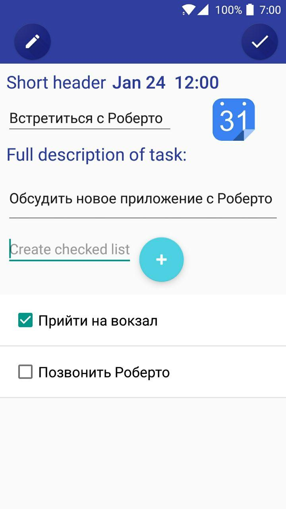
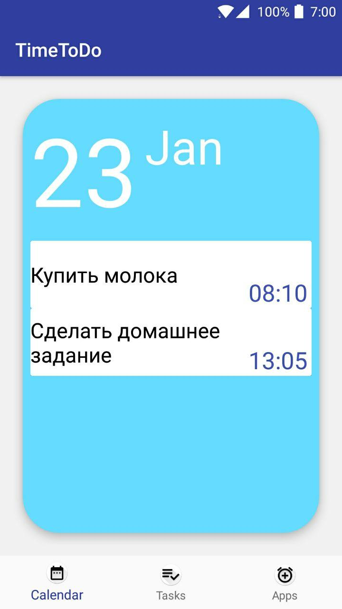

# Приложение Time ToDo

Это мобильное приложение, поможет вам следить за временем, устанавливать задачи и расписание. 

1. ## Social Media
Особенностью этого TaskManager и конкурентным отличием является возможность учета времени, проведенного в сторонних приложения. Например в социальных сетях. 

2. Задачи

Вы можете устанвливать задачи и подзадачи для них. Очень удобно.

3. ## Каледарь

Кроме этого, задачи выносятся на календарь и приложение может уведомить вас о предстоящих планах! 

**Создатели**: Оськин Роман, Павлов Иван, Толмачёв Александр 2018 год 